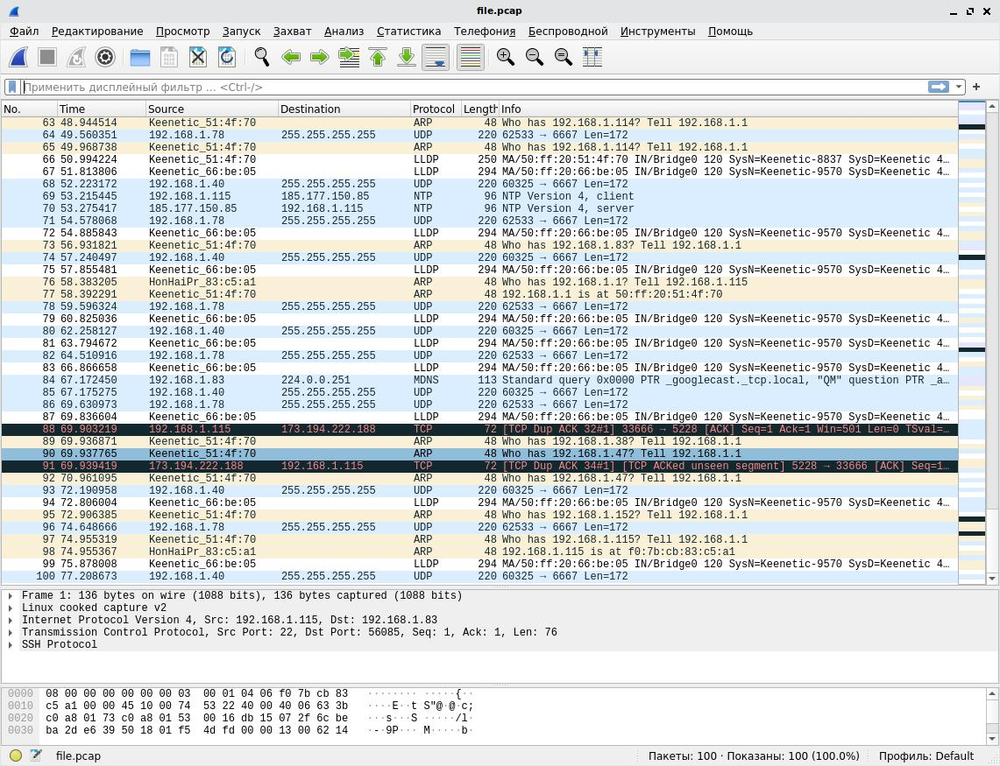

# Домашнее задание к занятию "3.9. Элементы безопасности информационных систем"

(1) Установите Bitwarden плагин для браузера. Зарегестрируйтесь и сохраните несколько паролей.

*Решение*


(2) Установите Google authenticator на мобильный телефон. Настройте вход в Bitwarden акаунт через Google authenticator OTP.

*Решение*

Установил приложение, добавил Bitwarden.


(3) Установите apache2, сгенерируйте самоподписанный сертификат, настройте тестовый сайт для работы по HTTPS.

*Решение*

Ниже указал последовательность моих действий, но в браузере сайт не открылся и при проверке на корректность настроек выдал следующее - AH00112: Warning: DocumentRoot [/var/www/test.site/public_html] does not exist - ругается что не существует директория, но как ее создать не понял. Подскажите куда копать?

```
root@vagrant:~# sudo openssl req -x509 -nodes -days 365 -newkey rsa:2048 -keyout /etc/ssl/private/apache-selfsigned.key -out /etc/ssl/certs/apache-selfsigned.crt
Generating a RSA private key
...+++++
.....................................+++++
writing new private key to '/etc/ssl/private/apache-selfsigned.key'
-----
You are about to be asked to enter information that will be incorporated
into your certificate request.
What you are about to enter is what is called a Distinguished Name or a DN.
There are quite a few fields but you can leave some blank
For some fields there will be a default value,
If you enter '.', the field will be left blank.
-----
Country Name (2 letter code) [AU]:RU
State or Province Name (full name) [Some-State]:Moscow
Locality Name (eg, city) []:Moscow
Organization Name (eg, company) [Internet Widgits Pty Ltd]:Company
Organizational Unit Name (eg, section) []:Org
Common Name (e.g. server FQDN or YOUR name) []:www.example.com
Email Address []:admin@example.com
root@vagrant:~# nano /etc/apache2/conf-available/ssl-params.conf
root@vagrant:~# cp /etc/apache2/sites-available/default-ssl.conf /etc/apache2/sites-available/default-ssl.conf.bak
root@vagrant:~# nano /etc/apache2/sites-available/default-ssl.conf
root@vagrant:~# nano /etc/apache2/sites-available/000-default.conf
root@vagrant:~# sudo a2enmod ssl
Considering dependency setenvif for ssl:
Module setenvif already enabled
Considering dependency mime for ssl:
Module mime already enabled
Considering dependency socache_shmcb for ssl:
Enabling module socache_shmcb.
Enabling module ssl.
See /usr/share/doc/apache2/README.Debian.gz on how to configure SSL and create self-signed certificates.
To activate the new configuration, you need to run:
  systemctl restart apache2
root@vagrant:~# sudo a2enmod headers
Enabling module headers.
To activate the new configuration, you need to run:
  systemctl restart apache2
root@vagrant:~# sudo a2ensite default-ssl
Enabling site default-ssl.
To activate the new configuration, you need to run:
  systemctl reload apache2
root@vagrant:~# sudo a2enconf ssl-params
Enabling conf ssl-params.
To activate the new configuration, you need to run:
  systemctl reload apache2
root@vagrant:~# sudo apache2ctl configtest
AH00558: apache2: Could not reliably determine the server's fully qualified domain name, using 127.0.1.1. Set the 'ServerName' directive globally to suppress this message
Syntax OK
root@vagrant:~# sudo systemctl restart apache2
```

Содержание файла /etc/apache2/sites-available/000-default.conf

```
<VirtualHost *:80>
        # The ServerName directive sets the request scheme, hostname and port that
        # the server uses to identify itself. This is used when creating
        # redirection URLs. In the context of virtual hosts, the ServerName
        # specifies what hostname must appear in the request's Host: header to
        # match this virtual host. For the default virtual host (this file) this
        # value is not decisive as it is used as a last resort host regardless.
        # However, you must set it for any further virtual host explicitly.
        #ServerName www.example.com

        #ServerAdmin webmaster@localhost
        #DocumentRoot /var/www/html
        Redirect "/" "https://localhost/"
        # Available loglevels: trace8, ..., trace1, debug, info, notice, warn,
        # error, crit, alert, emerg.
        # It is also possible to configure the loglevel for particular
        # modules, e.g.
        #LogLevel info ssl:warn

        ErrorLog ${APACHE_LOG_DIR}/error.log
        CustomLog ${APACHE_LOG_DIR}/access.log combined

        # For most configuration files from conf-available/, which are
        # enabled or disabled at a global level, it is possible to
        # include a line for only one particular virtual host. For example the
        # following line enables the CGI configuration for this host only
        # after it has been globally disabled with "a2disconf".
        #Include conf-available/serve-cgi-bin.conf
</VirtualHost>
```

Содержание файла /etc/apache2/sites-available/default-ssl.conf

```
<IfModule mod_ssl.c>
        <VirtualHost _default_:443>
                ServerAdmin your_email@example.com
                ServerName localhost

                DocumentRoot /var/www/html

                ErrorLog ${APACHE_LOG_DIR}/error.log
                CustomLog ${APACHE_LOG_DIR}/access.log combined

                SSLEngine on

                SSLCertificateFile      /etc/ssl/certs/apache-selfsigned.crt
                SSLCertificateKeyFile /etc/ssl/private/apache-selfsigned.key

                <FilesMatch "\.(cgi|shtml|phtml|php)$">
                                SSLOptions +StdEnvVars
                </FilesMatch>
                <Directory /usr/lib/cgi-bin>
                                SSLOptions +StdEnvVars
                </Directory>

        </VirtualHost>
</IfModule>
```

(4) Проверьте на TLS уязвимости произвольный сайт в интернете (кроме сайтов МВД, ФСБ, МинОбр, НацБанк, РосКосмос, РосАтом, РосНАНО и любых госкомпаний, объектов КИИ, ВПК ... и тому подобное).

*Решение*

После сканирования сайта найдены две потенциальные уязвимости: BREACH (CVE-2013-3587), LUCKY13 (CVE-2013-0169), experimental

```
root@vagrant:~/testssl.sh# ./testssl.sh -U --sneaky https://www.ozon.ru/

###########################################################
    testssl.sh       3.1dev from https://testssl.sh/dev/
    (740756b 2022-02-26 14:18:56 -- )

      This program is free software. Distribution and
             modification under GPLv2 permitted.
      USAGE w/o ANY WARRANTY. USE IT AT YOUR OWN RISK!

       Please file bugs @ https://testssl.sh/bugs/

###########################################################

 Using "OpenSSL 1.0.2-chacha (1.0.2k-dev)" [~183 ciphers]
 on vagrant:./bin/openssl.Linux.x86_64
 (built: "Jan 18 17:12:17 2019", platform: "linux-x86_64")


 Start 2022-02-28 17:44:05        -->> 45.60.40.164:443 (www.ozon.ru) <<--

 rDNS (45.60.40.164):    --
 Service detected:       HTTP


 Testing vulnerabilities

 Heartbleed (CVE-2014-0160)                not vulnerable (OK), no heartbeat extension
 CCS (CVE-2014-0224)                       not vulnerable (OK)
 Ticketbleed (CVE-2016-9244), experiment.  not vulnerable (OK)
 ROBOT                                     not vulnerable (OK)
 Secure Renegotiation (RFC 5746)           supported (OK)
 Secure Client-Initiated Renegotiation     not vulnerable (OK)
 CRIME, TLS (CVE-2012-4929)                not vulnerable (OK)
 BREACH (CVE-2013-3587)                    potentially NOT ok, "gzip" HTTP compression detected. - only supplied "/" tested
                                           Can be ignored for static pages or if no secrets in the page
 POODLE, SSL (CVE-2014-3566)               not vulnerable (OK)
 TLS_FALLBACK_SCSV (RFC 7507)              No fallback possible (OK), no protocol below TLS 1.2 offered
 SWEET32 (CVE-2016-2183, CVE-2016-6329)    not vulnerable (OK)
 FREAK (CVE-2015-0204)                     not vulnerable (OK)
 DROWN (CVE-2016-0800, CVE-2016-0703)      not vulnerable on this host and port (OK)
                                           make sure you don't use this certificate elsewhere with SSLv2 enabled services
                                           https://censys.io/ipv4?q=66799C5A87D7AB8A97925D1E4B1D6E05B7CACEAB3B24911190F825C992103124 could help you to find out
 LOGJAM (CVE-2015-4000), experimental      not vulnerable (OK): no DH EXPORT ciphers, no DH key detected with <= TLS 1.2
 BEAST (CVE-2011-3389)                     not vulnerable (OK), no SSL3 or TLS1
 LUCKY13 (CVE-2013-0169), experimental     potentially VULNERABLE, uses cipher block chaining (CBC) ciphers with TLS. Check patches
 Winshock (CVE-2014-6321), experimental    not vulnerable (OK)
 RC4 (CVE-2013-2566, CVE-2015-2808)        no RC4 ciphers detected (OK)


 Done 2022-02-28 17:44:53 [  51s] -->> 45.60.40.164:443 (www.ozon.ru) <<--

```

(5) Установите на Ubuntu ssh сервер, сгенерируйте новый приватный ключ. Скопируйте свой публичный ключ на другой сервер. Подключитесь к серверу по SSH-ключу.

*Решение*

```
root@vagrant:~# ssh-keygen
Generating public/private rsa key pair.
Enter file in which to save the key (/root/.ssh/id_rsa):
Enter passphrase (empty for no passphrase):
Enter same passphrase again:
Your identification has been saved in /root/.ssh/id_rsa
Your public key has been saved in /root/.ssh/id_rsa.pub
The key fingerprint is:
SHA256:LXZ7AwHIoLFtCYAzP7/t2Y46qax9AM46bUAbwihh9+k root@vagrant
The key's randomart image is:
+---[RSA 3072]----+
|o.o .o ..        |
|=. B .o  .       |
+----[SHA256]-----+
```

```
root@vagrant:~# ssh-copy-id -i .ssh/id_rsa artem@192.168.1.115
/usr/bin/ssh-copy-id: INFO: Source of key(s) to be installed: ".ssh/id_rsa.pub"
The authenticity of host '192.168.1.115 (192.168.1.115)' can't be established.
ECDSA key fingerprint is SHA256:SS2QxOoEVUS+Pw1O5MryuEQiFGTAepX0yg/Fuk79sPA.
Are you sure you want to continue connecting (yes/no/[fingerprint])? y
Please type 'yes', 'no' or the fingerprint: yes
/usr/bin/ssh-copy-id: INFO: attempting to log in with the new key(s), to filter out any that are already installed
/usr/bin/ssh-copy-id: INFO: 1 key(s) remain to be installed -- if you are prompted now it is to install the new keys
artem@192.168.1.115's password:

Number of key(s) added: 1

Now try logging into the machine, with:   "ssh 'artem@192.168.1.115'"
and check to make sure that only the key(s) you wanted were added.

root@vagrant:~# ssh artem@192.168.1.115
Linux artem-aspirer3610 5.10.0-11-amd64 #1 SMP Debian 5.10.92-1 (2022-01-18) x86_64

The programs included with the Debian GNU/Linux system are free software;
the exact distribution terms for each program are described in the
individual files in /usr/share/doc/*/copyright.

Debian GNU/Linux comes with ABSOLUTELY NO WARRANTY, to the extent
permitted by applicable law.
Last login: Sun Mar 13 14:53:55 2022 from 192.168.1.83
artem@artem-aspirer3610:~$
```

(6) Переименуйте файлы ключей из задания 5. Настройте файл конфигурации SSH клиента, так чтобы вход на удаленный сервер осуществлялся по имени сервера.

*Решение*

```
root@vagrant:~# sudo mv ~/.ssh/id_rsa ~/.ssh/id_rsa_devops
root@vagrant:~# nano ~/.ssh/config
root@vagrant:~# ssh SparkyLinux
Linux artem-aspirer3610 5.10.0-11-amd64 #1 SMP Debian 5.10.92-1 (2022-01-18) x86_64

The programs included with the Debian GNU/Linux system are free software;
the exact distribution terms for each program are described in the
individual files in /usr/share/doc/*/copyright.

Debian GNU/Linux comes with ABSOLUTELY NO WARRANTY, to the extent
permitted by applicable law.
Last login: Sun Mar 13 15:09:33 2022 from 192.168.1.83
artem@artem-aspirer3610:~$
```

Конфигурация файла ~/.ssh/config

```
Host SparkyLinux
        HostName 192.168.1.115
        User artem
        Port 22
        IdentityFile ~/.ssh/id_rsa_devops
```

(7) Соберите дамп трафика утилитой tcpdump в формате pcap, 100 пакетов. Откройте файл pcap в Wireshark.

*Решение*

```
artem@artem-aspirer3610:~$ sudo tcpdump -i any -c 100 -w file.pcap
tcpdump: data link type LINUX_SLL2
tcpdump: listening on any, link-type LINUX_SLL2 (Linux cooked v2), snapshot length 262144 bytes
100 packets captured
100 packets received by filter
0 packets dropped by kernel
```


