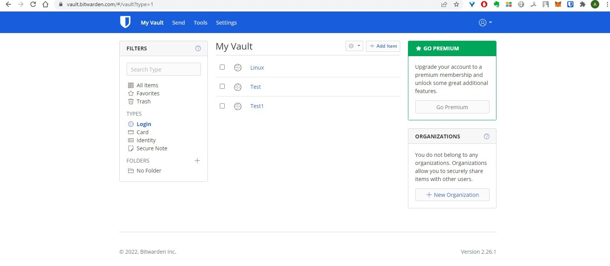
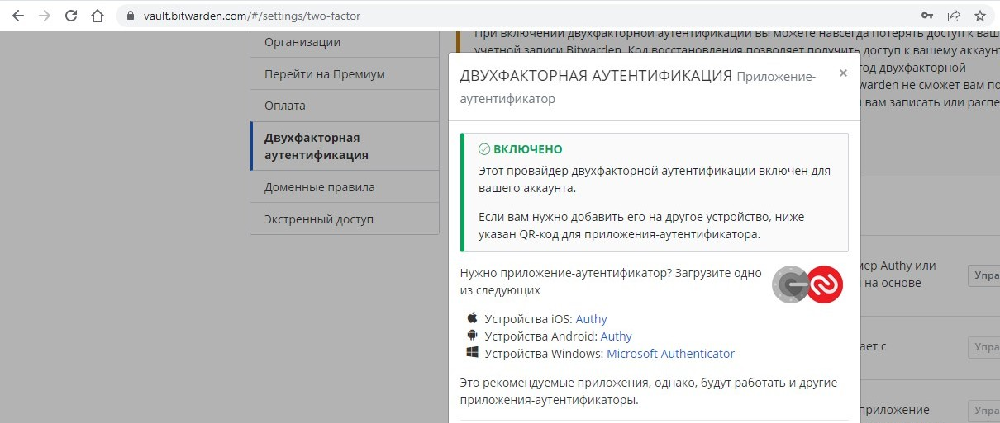

# Домашнее задание к занятию "3.9. Элементы безопасности информационных систем"

(1) Установите Bitwarden плагин для браузера. Зарегестрируйтесь и сохраните несколько паролей.

*Решение*



(2) Установите Google authenticator на мобильный телефон. Настройте вход в Bitwarden акаунт через Google authenticator OTP.

*Решение*

Установил приложение, добавил Bitwarden.



(3) Установите apache2, сгенерируйте самоподписанный сертификат, настройте тестовый сайт для работы по HTTPS.

*Решение*

Ниже указал последовательность моих действий, но в браузере сайт не о Подскажите куда копать?

```
artem@artem-aspirer3610:~$ sudo systemctl enable apache2
Synchronizing state of apache2.service with SysV service script with /lib/systemd/systemd-sysv-install.
Executing: /lib/systemd/systemd-sysv-install enable apache2
artem@artem-aspirer3610:~$ Sudo a2enmod ssl
bash: Sudo: команда не найдена
artem@artem-aspirer3610:~$ sudo a2enmod ssl
Considering dependency setenvif for ssl:
Module setenvif already enabled
Considering dependency mime for ssl:
Module mime already enabled
Considering dependency socache_shmcb for ssl:
Enabling module socache_shmcb.
Enabling module ssl.
See /usr/share/doc/apache2/README.Debian.gz on how to configure SSL and create self-signed certificates.
To activate the new configuration, you need to run:
  systemctl restart apache2
artem@artem-aspirer3610:~$ sudo systemctl restart apache2
artem@artem-aspirer3610:~$ sudo openssl req -x509 -nodes -days 365 -newkey rsa:2048 -keyout /etc/ssl/private/apache-selfsigned.key -out /etc/ssl/certs/apache-selfsigned.crt

[sudo] пароль для artem: 
Generating a RSA private key
.................+++++
...........................................................................+++++
writing new private key to '/etc/ssl/private/apache-selfsigned.key'
-----
You are about to be asked to enter information that will be incorporated
into your certificate request.
What you are about to enter is what is called a Distinguished Name or a DN.
There are quite a few fields but you can leave some blank
For some fields there will be a default value,
If you enter '.', the field will be left blank.
-----
Country Name (2 letter code) [AU]:RU
State or Province Name (full name) [Some-State]:Moscow
Locality Name (eg, city) []:Moscow
Organization Name (eg, company) [Internet Widgits Pty Ltd]:Company
Organizational Unit Name (eg, section) []:Org
Common Name (e.g. server FQDN or YOUR name) []:www.example.com
Email Address []:admin@example.com
artem@artem-aspirer3610:~$ sudo nano /etc/apache2/sites-available/example_com.conf                                                                    
artem@artem-aspirer3610:~$ sudo mkdir /var/www/example_com  

artem@artem-aspirer3610:~$ sudo nano /var/www/example_com/index.html

artem@artem-aspirer3610:~$ sudo a2ensite example_com.conf

Enabling site example_com.
To activate the new configuration, you need to run:
  systemctl reload apache2
artem@artem-aspirer3610:~$ systemctl reload apache2
Failed to reload apache2.service: Access denied
See system logs and 'systemctl status apache2.service' for details.
artem@artem-aspirer3610:~$ systemctl reload apache2
Failed to reload apache2.service: Access denied
See system logs and 'systemctl status apache2.service' for details.
artem@artem-aspirer3610:~$ systemctl reload apache2
artem@artem-aspirer3610:~$ sudo apache2ctl configtest
AH00558: apache2: Could not reliably determine the server's fully qualified domain name, using 127.0.1.1. Set the 'ServerName' directive globally to suppress this message
Syntax OK

```


Содержание файла /etc/apache2/sites-available/example_com.conf

```
<VirtualHost *:443>
   ServerName example_com
   DocumentRoot /var/www/example_com

   SSLEngine on
   SSLCertificateFile /etc/ssl/certs/apache-selfsigned.crt
   SSLCertificateKeyFile /etc/ssl/private/apache-selfsigned.key
</VirtualHost>
```

?????? Содержание файла /etc/apache2/sites-available/default-ssl.conf

```
<IfModule mod_ssl.c>
    <VirtualHost _default_:443>
            ServerAdmin your_email@example.com
            ServerName 127.0.0.1

            DocumentRoot /var/www/html

            ErrorLog ${APACHE_LOG_DIR}/error.log
            CustomLog ${APACHE_LOG_DIR}/access.log combined

            SSLEngine on

            SSLCertificateFile      /etc/ssl/certs/apache-selfsigned.crt
            SSLCertificateKeyFile /etc/ssl/private/apache-selfsigned.key

            <FilesMatch "\.(cgi|shtml|phtml|php)$">
                            SSLOptions +StdEnvVars
            </FilesMatch>
            <Directory /usr/lib/cgi-bin>
                            SSLOptions +StdEnvVars
            </Directory>
    </VirtualHost>

</IfModule>
```

(4) Проверьте на TLS уязвимости произвольный сайт в интернете (кроме сайтов МВД, ФСБ, МинОбр, НацБанк, РосКосмос, РосАтом, РосНАНО и любых госкомпаний, объектов КИИ, ВПК ... и тому подобное).

*Решение*

После сканирования сайта найдены две потенциальные уязвимости: BREACH (CVE-2013-3587), LUCKY13 (CVE-2013-0169), experimental

```
root@vagrant:~/testssl.sh# ./testssl.sh -U --sneaky https://www.ozon.ru/

###########################################################
    testssl.sh       3.1dev from https://testssl.sh/dev/
    (740756b 2022-02-26 14:18:56 -- )

      This program is free software. Distribution and
             modification under GPLv2 permitted.
      USAGE w/o ANY WARRANTY. USE IT AT YOUR OWN RISK!

       Please file bugs @ https://testssl.sh/bugs/

###########################################################

 Using "OpenSSL 1.0.2-chacha (1.0.2k-dev)" [~183 ciphers]
 on vagrant:./bin/openssl.Linux.x86_64
 (built: "Jan 18 17:12:17 2019", platform: "linux-x86_64")


 Start 2022-02-28 17:44:05        -->> 45.60.40.164:443 (www.ozon.ru) <<--

 rDNS (45.60.40.164):    --
 Service detected:       HTTP


 Testing vulnerabilities

 Heartbleed (CVE-2014-0160)                not vulnerable (OK), no heartbeat extension
 CCS (CVE-2014-0224)                       not vulnerable (OK)
 Ticketbleed (CVE-2016-9244), experiment.  not vulnerable (OK)
 ROBOT                                     not vulnerable (OK)
 Secure Renegotiation (RFC 5746)           supported (OK)
 Secure Client-Initiated Renegotiation     not vulnerable (OK)
 CRIME, TLS (CVE-2012-4929)                not vulnerable (OK)
 BREACH (CVE-2013-3587)                    potentially NOT ok, "gzip" HTTP compression detected. - only supplied "/" tested
                                           Can be ignored for static pages or if no secrets in the page
 POODLE, SSL (CVE-2014-3566)               not vulnerable (OK)
 TLS_FALLBACK_SCSV (RFC 7507)              No fallback possible (OK), no protocol below TLS 1.2 offered
 SWEET32 (CVE-2016-2183, CVE-2016-6329)    not vulnerable (OK)
 FREAK (CVE-2015-0204)                     not vulnerable (OK)
 DROWN (CVE-2016-0800, CVE-2016-0703)      not vulnerable on this host and port (OK)
                                           make sure you don't use this certificate elsewhere with SSLv2 enabled services
                                           https://censys.io/ipv4?q=66799C5A87D7AB8A97925D1E4B1D6E05B7CACEAB3B24911190F825C992103124 could help you to find out
 LOGJAM (CVE-2015-4000), experimental      not vulnerable (OK): no DH EXPORT ciphers, no DH key detected with <= TLS 1.2
 BEAST (CVE-2011-3389)                     not vulnerable (OK), no SSL3 or TLS1
 LUCKY13 (CVE-2013-0169), experimental     potentially VULNERABLE, uses cipher block chaining (CBC) ciphers with TLS. Check patches
 Winshock (CVE-2014-6321), experimental    not vulnerable (OK)
 RC4 (CVE-2013-2566, CVE-2015-2808)        no RC4 ciphers detected (OK)


 Done 2022-02-28 17:44:53 [  51s] -->> 45.60.40.164:443 (www.ozon.ru) <<--

```

(5) Установите на Ubuntu ssh сервер, сгенерируйте новый приватный ключ. Скопируйте свой публичный ключ на другой сервер. Подключитесь к серверу по SSH-ключу.

*Решение*

(6) Переименуйте файлы ключей из задания 5. Настройте файл конфигурации SSH клиента, так чтобы вход на удаленный сервер осуществлялся по имени сервера.

*Решение*

(7) Соберите дамп трафика утилитой tcpdump в формате pcap, 100 пакетов. Откройте файл pcap в Wireshark.

*Решение*
